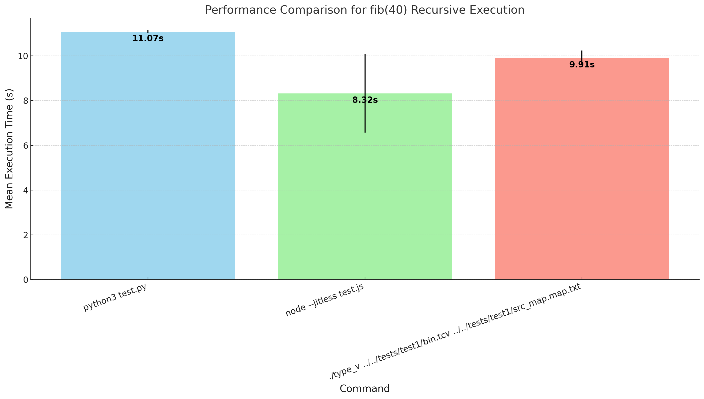
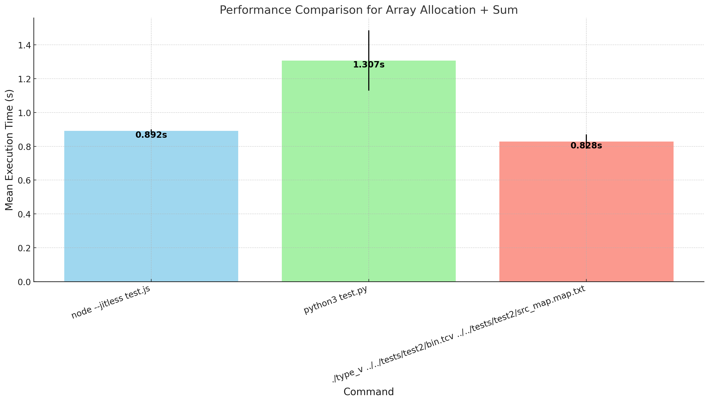
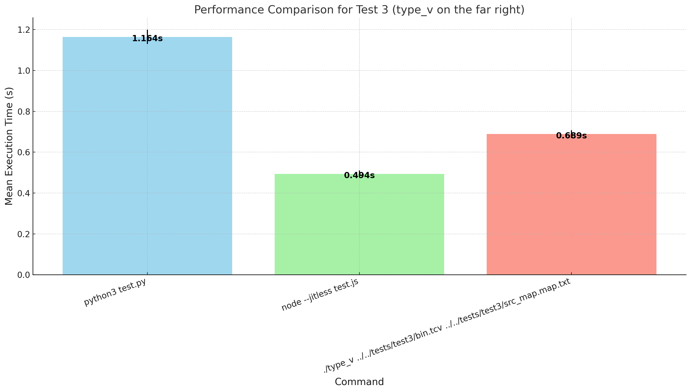

    
<table>
    <tr>
        <td>
            

                
            

        </td>
    </tr>
    <tr>
        <td>
            

Type-V is a virtual machine and runtime environment for type-c programs. 
While the VM can be used for generic purposes, 
its instructions are heavily optimized for type-c source code, 
such as offset-based data types (structs, arrays, classes, interfaces, etc), 
            

        </td>
    </tr>
</table>

## About
Type-V is a virtual machine and runtime environment for type-c programs. 
The Type-C compiler can be found at [https://github.com/unlimitedsoftwareworks/type-c](https://github.com/unlimitedsoftwareworks/type-c).

Type-V is written in C11 and has minimal dependencies. 

The VM tries to store minimal RTTI and is currently very unoptimized. Type-V development goes hand in hand with the Type-C compiler.

Here are the current planne and implemented features:

- [x] All instructions for all data types
- [x] Closures
- [x] Coroutines
- [x] Source Mapping
- [ ] GC (So far only scavenger is implemented, can allocate up to 1Mb)
- [ ] JIT (Just in time compilation in 2050)
- [ ] Disassembler
- [ ] Lots of optimizations

Type-V performance is very comparable to node in interpreter mode (JIT off, since Type-V doesn't have JIT yet). Type-V even beats node on some benchmarks (unpublished).

## Why Type-V
Type-V is a runtime environment for type-c. All instructions are optimized for type-c source code, they are all typed and the VM tries to store minimal RTTI (yet somehow i feel like i'm not succeeding).

### Licenses
| Name   |License|     Usage      |Link|
|:-------|:---|:--------------|:---|
| libtable|MIT| Table printing |https://github.com/marchelzo/libtable|

### Notes
- Type-V is not production ready yet.
- Type-V is not optimized yet.
- Type-V is not secure yet.
- Type-V is not documented yet.
- Type-V is not fully tested yet.
- Type-V is not JIT'ed yet.

## Benchmarks

These benchmarks are compiled with the Type-C compiler and ran with Type-V.
Currently Type-C doesn't perform any optimizations at all. So there is a lot of room for improvement.

#### Hardware & OS:
The performance evaluation was conducted on a system powered by **AMD EPYC Processor** (Family 25, Model 1, Stepping 1).
- **Cores and Threads**: The CPU consists of **2 logical processors** with **1 physical core** (2 threads per core).
- **Clock Speed**: The **base frequency** is **2.4 GHz** (2396.398 MHz).
- **Cache**:
  - **L2 Cache Size**: **512 KB** per core.
- **Microarchitecture**: **AMD EPYC series**
- **Memory and Cache Alignment**: The **cache line size** is **64 bytes**, with **TLB (Translation Lookaside Buffer) size** supporting **1024 4K pages**.
- **Address Sizes**: The processor supports **40-bit physical** and **48-bit virtual address spaces**.
- RAM: `2Gb`
- **OS**: Ubuntu 24.04.1 LTS codename `noble`

- Python: `Python 3.12.3 (main, Sep 11 2024, 14:17:37) [GCC 13.2.0] on linux`
- Node: `Welcome to Node.js v18.19.1.`

#### Fibonacci(40), recursive
Non-optimized versions, just to test context switching.

#### Large array addition (100M elements)
Elements are preallocated for two arrays.

#### Nested member access within large loop

