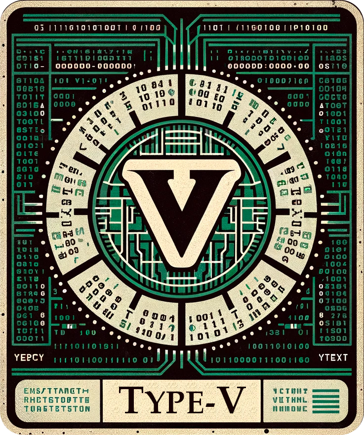

<table>
    <tr>
        <td>
            <p align="center">
                
            </p>
        </td>
    </tr>
    <tr>
        <td>
            <center>
Type-V is a virtual machine and runtime environment for type-c programs. 
While the VM can be used for generic purposes, 
its instructions are heavily optimized for type-c source code, 
such as offset-based data types (structs, arrays, classes, interfaces, shadow structs, etc), 
built-in concurrency, etc.
            </center>
        </td>
    </tr>
</table>


### Status
As for the right now, the VM is still experimental and lacking major features.

Progress:

- [x] Assembler
- [x] Instruction set specification
- [x] Processes (not to be confused with OS processes)
- [ ] VM API passes valgrind checks (doesn't count bytecode allocated memory since it's supposed to be handled by GC)
- [ ] Non-blocking I/O 
- [ ] Garbage collection
- [ ] Unit tests

### Bytecode example:

As of the right now, the instructions themselves are solid, however the instruction names
in the assembler are subject to change.

```asm
VERSION: 1

CONST:

GLOBAL:
    x: u64 = 0
CODE:
    p_queue_size r0
    debug_reg r0

    ; spawn
    p_alloc r1 proc1
    p_alloc r2 proc1
    mv_reg_i r15 10
    p_emit r1 r15
    p_emit r2 r15
    p_send_sig r1 2   ; KILL signal
    p_send_sig r2 1   ; TERMINATE signal
    halt


proc1:
    p_wait_queue
    p_dequeue r14
    p_cid r1
    add_u32 r1 r14 r1
    debug_reg r1
    j proc1
```

### Licenses
| Name   |License|     Usage      |Link|
|:-------|:---|:--------------|:---|
| libtable|MIT| Table printing |https://github.com/marchelzo/libtable|

### License
